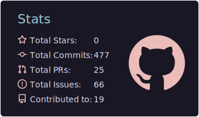
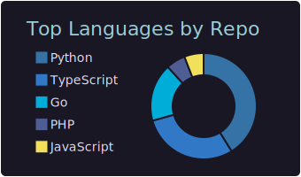
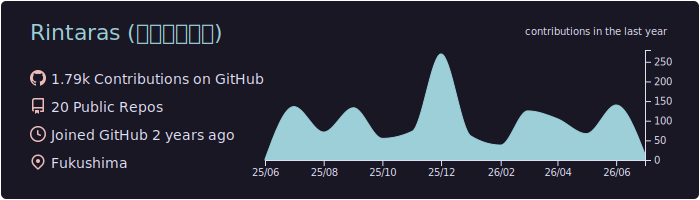

<div align="center">

#  Hello! I'm <span style="color:#F7A41D">Rintaras</span> 
</div>


```javascript
const rintaras = {
    pronouns: "he/him",
    location: "Japan",
    currentFocus: "Software Development & AI/ML",
    learning: ["Programming", "WebAssembly", "Cloud Architecture"],
    interests: ["Open Source", "Web3", "IoT", "Computer Vision"],
    motto: "Code with passion, learn with curiosity!"
};
```


<div align="center">

</div>

## Tech Stack & Skills


<div align="center">

### Frontend


### Backend


### Cloud & DevOps


### Databases & Storage


### Tools


### Mobile


</div>


## GitHub Analytics

<div align="center">


<table>
  <tr>
    <td width="50%">
      
    </td>
    <td width="50%">
      
    </td>
  </tr>
</table>





</div>
<div align="center">


<table>
  <tr>
    <td align="center">
      <a href="https://x.com/Rintaras">
        
      </a>
    </td>
    <td align="center">
      <a href="https://linkedin.com/in/凛生-佐藤-65789a352">
        
      </a>
    </td>
  </tr>
</table>

</div>
